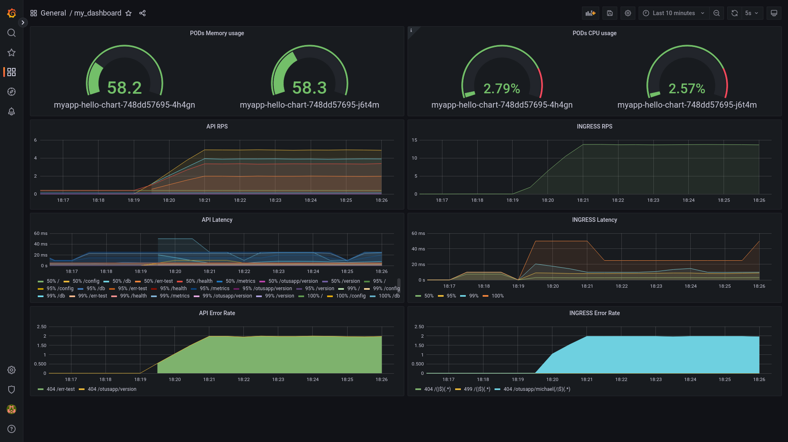

#Домашнее задание
 «Prometheus. Grafana»

Описание/Пошаговая инструкция выполнения домашнего задания:

```
Инструментировать сервис из прошлого задания метриками в формате Prometheus с помощью библиотеки для вашего фреймворка и ЯП.
Сделать дашборд в Графане, в котором были бы метрики с разбивкой по API методам:
1. Latency (response time) с квантилями по 0.5, 0.95, 0.99, max
2. RPS
3. Error Rate - количество 500ых ответов
Добавить в дашборд графики с метрикам в целом по сервису, взятые с nginx-ingress-controller:
4. Latency (response time) с квантилями по 0.5, 0.95, 0.99, max
5. RPS
6. Error Rate - количество 500ых ответов
Настроить алертинг в графане на Error Rate и Latency.
На выходе должно быть:

1. скриншоты дашборды с графиками в момент стресс-тестирования сервиса. Например, после 5-10 минут нагрузки.
```

```
2. json-дашборды.
```
[json](dashboard.json)
```
Задание со звездочкой (+5 баллов)
    Используя существующие системные метрики из кубернетеса, добавить на дашборд графики с метриками:
```
  - Потребление подами приложения памяти
  - Потребление подами приолжения CPU
```

Инструментировать базу данных с помощью экспортера для prometheus для этой БД.

Добавить в общий дашборд графики с метриками работы БД.


## Окружение
```
Docker version 20.10.17, build 100c701

helm version
version.BuildInfo{Version:"v3.9.4", GitCommit:"dbc6d8e20fe1d58d50e6ed30f09a04a77e4c68db", GitTreeState:"clean", GoVersion:"go1.17.13"}

minikube version: v1.25.2
commit: 362d5fdc0a3dbee389b3d3f1034e8023e72bd3a7

```

## Развертывание стэнда


Локальная отладка сервиса
~~~
debug.sh
~~~

Установить сервис:
~~~
deploy.sh
~~~

Выполнить стресс-тестирование:
~~~
stresstest.sh
~~~

Пробросить порты для прометеуса/графаны:
~~~
kubectl port-forward service/prom-grafana 9000:80
kubectl port-forward service/prom-kube-prometheus-stack-prometheus 9090
~~~


Удалить сервис после тестирования:
~~~
destroy.sh
~~~
