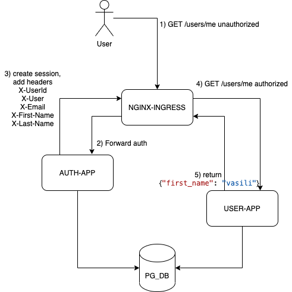

# Домашнее задание
 «Backend for frontends. Apigateway»

Описание/Пошаговая инструкция выполнения домашнего задания:

---
Добавить в приложение аутентификацию и регистрацию пользователей.
Реализовать сценарий "Изменение и просмотр данных в профиле клиента".
Пользователь регистрируется. Заходит под собой и по определенному урлу получает данные о своем профиле. Может поменять данные в профиле. Данные профиля для чтения и редактирования не должны быть доступны другим клиентам (аутентифицированным или нет).

На выходе должны быть:
1. описание архитектурного решения и схема взаимодействия сервисов (в виде картинки)

2. команда установки приложения (из helm-а или из манифестов). Обязательно указать в каком namespace нужно устанавливать.
3. команда установки api-gateway, если он отличен от nginx-ingress.
4. тесты постмана, которые прогоняют сценарий:
- регистрация пользователя 1
- проверка, что изменение и получение профиля пользователя недоступно без логина
- вход пользователя 1
- изменение профиля пользователя 1
- проверка, что профиль поменялся
- выход* (если есть)
- регистрация пользователя 2
- вход пользователя 2
- проверка, что пользователь2 не имеет доступа на чтение и редактирование профиля пользователя1.

В тестах обязательно
- наличие {{baseUrl}} для урла
- использование домена arch.homework в качестве initial значения {{baseUrl}}
- использование сгенерированных случайно данных в сценарии
- отображение данных запроса и данных ответа при запуске из командной строки с помощью newman.


## Окружение
```
Docker version 20.10.17, build 100c701

helm version
version.BuildInfo{Version:"v3.9.4", GitCommit:"dbc6d8e20fe1d58d50e6ed30f09a04a77e4c68db", GitTreeState:"clean", GoVersion:"go1.17.13"}

minikube version: v1.25.2
commit: 362d5fdc0a3dbee389b3d3f1034e8023e72bd3a7

newman -version 5.3.2
```

## Развертывание стэнда


Предварительная установка
```bash
./pre_init_bitnami.sh
./pre_init_ingress.sh
```

Развертывание
```bash
./deploy.sh
```

Запуск тестов
```bash
newman run "otus-api-gateway play.postman_collection.json"
```

Удалить сервис после тестирования:
```bash
./destroy.sh
```


