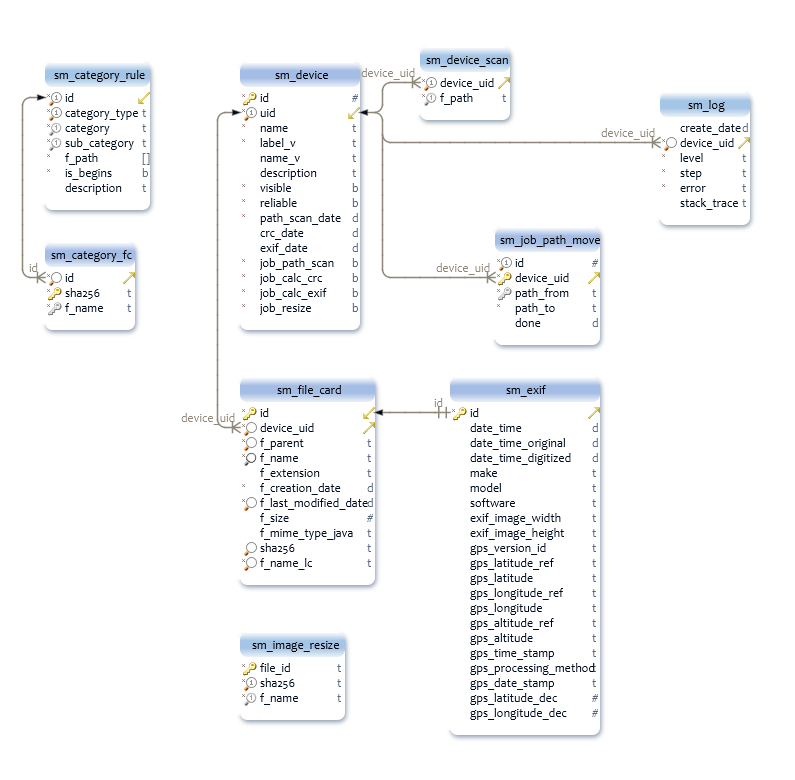
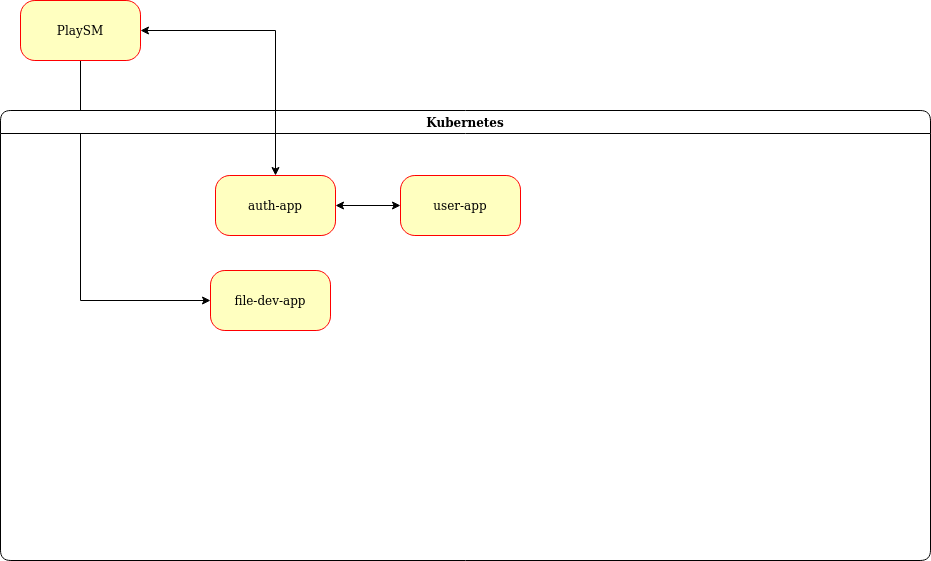
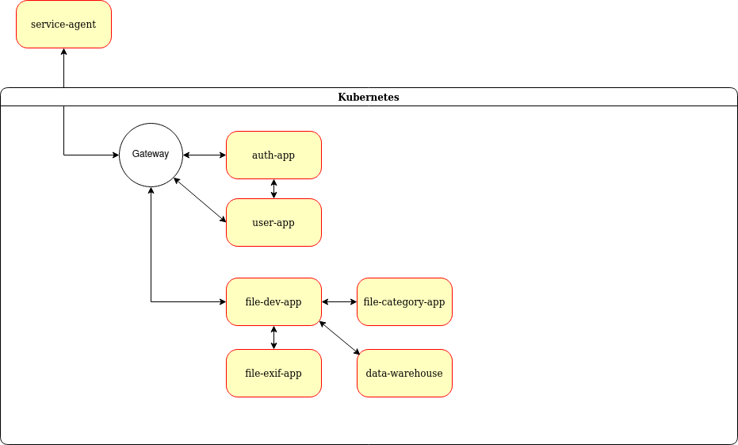

# Проект
 «Microservice storage file manager»

## Описание архитектуры

Схема БД монолитного приложения




Основные компоненты системы:
- NGINX Ingress - используется как точка входа для всех API. Настроен на Host - arch.homework
- Auth Service - сервис для работы с аутентификационными данными пользователей.
- User Profile Service - сервис для работы с контактными данными пользователей.
- File Device Service - сервис для хранения информации о файлах и устройствах

Текущее состояние проекта



Целевая реализация проекта




## Окружение
```
Docker version 20.10.17, build 100c701

helm version
version.BuildInfo{Version:"v3.9.4", GitCommit:"dbc6d8e20fe1d58d50e6ed30f09a04a77e4c68db", GitTreeState:"clean", GoVersion:"go1.17.13"}

minikube version: v1.25.2
commit: 362d5fdc0a3dbee389b3d3f1034e8023e72bd3a7

newman -version 5.3.2
```

## Развертывание стэнда


Предварительная установка
```bash
./pre_init_bitnami.sh
./pre_init_ingress.sh
./pre_init_prometheus.sh
```

Развертывание
```bash
./deploy.sh
```

Запуск тестов
```bash
newman run "otus-msa-project cluster.postman_collection.json"
```

Удалить сервис после тестирования:
```bash
./destroy.sh && ./post_destroy.sh
```

http://arch.homework:9100/metrics

```bash
kubectl get svc --selector app.kubernetes.io/name=postgresql -o go-template-file=reports/services-nodeports.gotemplate --namespace $KS_MY_NS
```


# Ссылки
